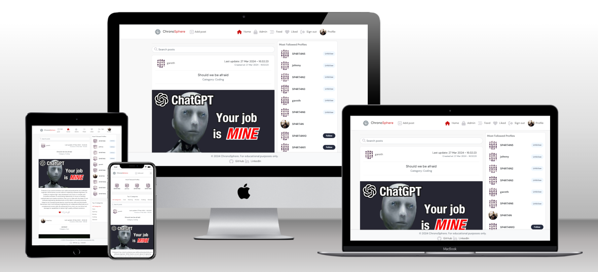
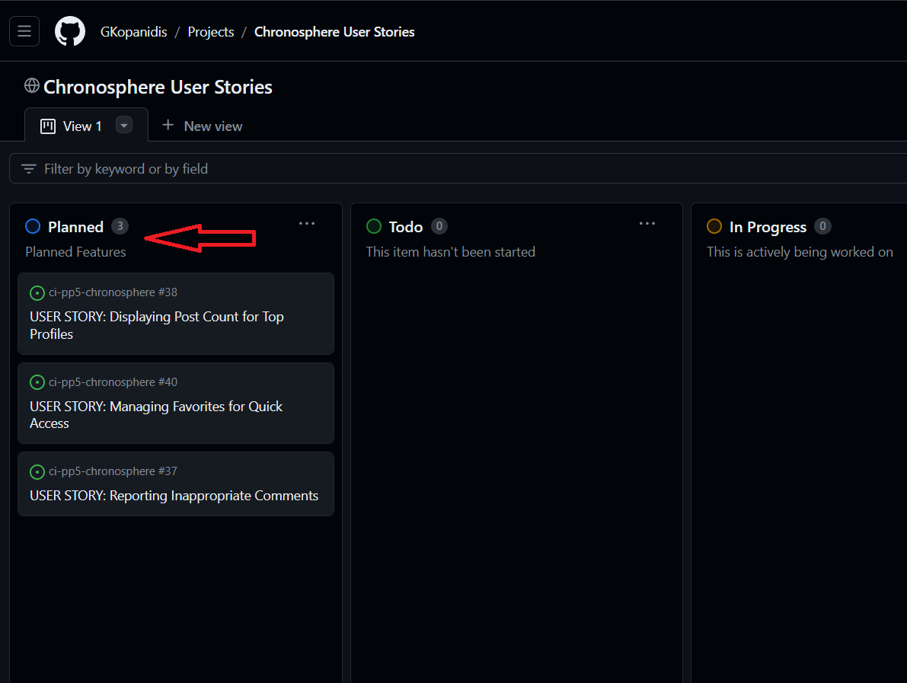

# [ChronoSphere](https://ci-pp5-chronosphere-fae2dfb25e8d.herokuapp.com/)

Dive into the world of ChronoSphere, where every second counts and every moment tells a story. Create your profile today and join a growing community ready to push the boundaries of digital communication. Welcome to ChronoSphere – where time never stands still, and every moment matters.

## Index - Table of Contents

- [Explore Our Content](#explore-our-content)
- [Agile Planning and Development Process](#agile-planning-and-development-process)
  - [Kanban Board](#kanban-board)
  - [Epics and User Stories](#epics-and-user-stories)
  - [Site Goals](#site-goals)

- [Overview](#overview)
  - [Existing Features](#existing-features)
  - [Features Planned](#features-planned)

- [Bugs](#bugs)
  - [Fixed Bugs](#fixed-bugs)
  - [Unfixed Bugs](#unfixed-bugs)

- [Testing](#testing)

- [Technical Features](#technical-features)
  - [Responsive Design](#responsive-design)
  - [CRUD on Posts and Comments](#crud-on-posts-and-comments)
  - [Streamlined and Intuitive Interface](#streamlined-and-intuitive-interface)

- [Design](#design)
  - [Wireframes](#wireframes)
  - [ERD](#erd)

- [Technolgies](#technologies)

- [Deployment](#deployment)
   - [Version Control](#version-control)
   - [Heroku Deployment](#heroku-deployment)
   - [Creating a Database](#creating-a-database)
   - [The env.py File](#the-envpy-file)
   - [Run Locally](#run-locally)
   - [Fork Project](#fork-project)
      
- [Credits](#credits)

   - [Media](#media)
   - [Acknowledgments](#acknowledgments)

## **Explore Our Content:**

ChronoSphere is a dynamic social media platform designed to connect users from around the globe. Focused on community and the power of sharing, ChronoSphere offers a unique experience that allows users to share moments, exchange ideas, and deepen relationships. Whether you're looking to discover the latest trends, share inspiring content, or simply stay in touch with friends, ChronoSphere is the perfect place to forge authentic and meaningful connections.

The platform stands out with its intuitive interface, making it easy to navigate and discover new content. From exciting posts to the latest likes and most-followed profiles, ChronoSphere brings the world to your fingertips. Featuring capabilities such as adding posts, liking, commenting, and customizing your feed to suit your preferences, ChronoSphere provides a personalized and interactive experience.

[ChronoSphere live site](https://ci-pp5-chronosphere-fae2dfb25e8d.herokuapp.com/)

[Back to Top](#index---table-of-contents)

## Agile Planning and Development Process

The development of HW|Blog followed an Agile methodology, utilizing a Kanban board hosted on GitHub to manage tasks and workflows. This approach made it easier to focus on immediate tasks while also keeping an eye on the broader project goals and progress.

### Kanban Board

[Link to the board](https://github.com/users/GKopanidis/projects/6)

The board was divided into three primary columns:

- **Todo:** Tasks that are planned but not yet in progress.
- **In Progress:** Tasks currently being worked on.
- **Done:** Tasks that have been completed.

Each task was created as an issue and then categorized into Epics and User Stories for better organization and focus.

### Epics and User Stories

Prior to starting development, Epics and User Stories were created to define the scope and goals of the project. This made it easier to break down the project into smaller, manageable chunks and helped in tracking progress effectively.

- **Epics**: Large areas of work that contain multiple tasks.
- **User Stories**: Smaller tasks that contribute to the completion of an Epic.

This Agile planning setup contributed significantly to the efficient and focused development of Loop

### Site Goals

**For Users:**

- **Discover:** Navigate through a comprehensive timeline of historical events, exploring detailed articles, timelines, and interactive content that span across different eras and topics.
- **Learn:** Gain deep insights and understanding of historical contexts, significance, and the interconnectedness of events through engaging, well-researched content.
- **Participate:** Contribute to the ChronoSphere community by sharing your own historical knowledge, submitting articles, or suggesting edits to existing content to enhance accuracy and depth.
- **Connect:** Engage with history enthusiasts, scholars, and educators. Participate in discussions, debates, and forums to exchange ideas, interpretations, and perspectives.
- **Personalize:** Customize your learning experience by saving favorite articles, creating personalized timelines, and setting preferences for the types of history you're most interested in.

**For Site Owners:**

- **Educate:** Provide a high-quality, accessible platform for users of all ages and backgrounds to learn about history in a dynamic and interactive way. Ensure content is thoroughly researched, factually accurate, and regularly updated.
- **Cultivate:** Foster a vibrant, respectful community of history enthusiasts who are encouraged to share their insights, contribute content, and engage in meaningful discussions.
- **Innovate:** Continuously improve ChronoSphere by introducing new technologies, interactive elements, and features that enhance user engagement and learning experiences.
- **Expand:** Grow the ChronoSphere user base by reaching out to educational institutions, history bloggers, and social media platforms to promote the site and its resources.
- **Support:** Offer comprehensive support and resources to users and contributors, including guides on how to use the site, contribute content, and engage with the community. Provide clear channels for feedback and suggestions to ensure the site meets the needs and expectations of its users.

### Existing Features for Users on ChronoSphere

**Navigation and Accessibility:**

- **Navigation Bar:** A consistently positioned and styled navigation bar across all pages for effortless site exploration.
- **Swift Page Transitions:** Rapid navigation between pages without the need for page reloads, ensuring a smooth and uninterrupted experience.
- **Post Exploration:** Direct access to detailed post pages from the main feed to delve into discussions and related interactions.

**Account Management:**

- **Streamlined Account Creation:** A straightforward sign-up process with immediate feedback upon successful account creation.
- **Effortless Sign-In Process:** An easy-to-use login form, secure authentication, and direct navigation to personalized areas post-login.
- **Visibility and Management of Authentication Status:** Clear indicators of login status with simple login or logout options and dynamic updates within the interface.

**Content Interaction:**

- **Post Creation and Management:** Users can easily create, edit, and delete their posts, with the ability to upload images and receive feedback upon successful actions.
- **Engagement with Content:** Options to like posts, view comprehensive post details, and explore comments for deeper engagement with content.
- **Community Interaction:** Ability to comment on posts, manage (edit or delete) comments, and view comments organized in a readable manner.

**Content Discovery:**

- **Latest Posts and Real-time Updates:** The newest posts are displayed prominently, with real-time updates to ensure users are always in the know.
- **Keyword-Based Search:** An accessible search bar allows users to find posts and profiles that match their interests.
- **ersonalized Content Curation:** Features like following user content, accessing liked posts, and managing favorites for quick content access.

**User Profiles and Community:**

- **User Profile Exploration:** Direct access to user profiles to discover posts, bio, and statistics, enhancing community connection.
- **Nested Commenting:** Structured discussions through nested commenting on posts for a clearer, more organized engagement.

### Existing Features for Site Owners on ChronoSphere

**User Experience and Interface:**

- **Consistent Design:** A unified and consistent design for the navigation bar and other UI elements across the platform.
- **Real-time Content Management:** Immediate updates for content creation, edits, and deletions, ensuring a dynamic and engaging user experience.

**Security and Authentication:**

- **Secure Account Management:** Protection of user information with secure authentication methods and the ability to update usernames and passwords.

**Community and Engagement:**

- **Innovative Engagement Features:** Implementation of features like infinite scroll, live updates for likes, and nested commenting to foster a vibrant community.
- **User Profile Management:** Tools for users to personalize their profiles and for site owners to highlight popular or influential community members.

**Content Discovery and Management:**

- **Enhanced Search and Discovery:** Advanced search capabilities and filtering options to aid users in discovering relevant content and profiles.
- **Content Moderation:** Features allowing users to report inappropriate comments and for site owners to manage these reports effectively.

**User Support and Feedback:**

- **Support for User Navigation:** User-friendly error pages for non-existent links and a clear pathway back to main content areas to reduce frustration and enhance navigation.

**Expansion and Development:**

- **Community Development Tools:** Features that allow users to engage, follow, and connect with each other, supporting the growth of the community.
- **Continuous Innovation:** Commitment to introducing new features and content based on user feedback and technological advancements to keep the platform fresh and engaging.

## Technical Features

### Responsive Design

ChronoSphere was designed with adaptability in mind to ensure a seamless user experience across different devices, such as desktop computers, tablets, and mobile phones.

### CRUD on Posts, Comments and Profiles

The platform supports comprehensive CRUD (Create, Read, Update, Delete) actions for posts, comments and profiles created by users.

### Streamlined and Intuitive Interface

Prioritizing ease of navigation, ChronoSphere is equipped with a straightforward and intuitive layout, allowing users to explore the site effortlessly.

[Back to Top](#index---table-of-contents)

### Features Planned

- **Reporting Inappropriate Comments** As a user, I want the ability to report comments that violate the community guidelines so that the platform remains a safe and respectful environment for all users.

- **Displaying Post Count for Top Profiles** IAs a user viewing the top profiles, I want to see the number of posts each top user has made so that I can gauge their activity level and contribution to the community.

- **Managing Favorites for Quick Access** As a user, I want to add posts to a favorites list and have a dedicated tab for my favorites so that I can quickly access posts I've marked as interesting or important.

- **Optimize image uploads by users:** Every image, if not already in WEBP format, should be automatically converted to WEBP to prevent any deterioration in page loading time.

[Back to Top](#index---table-of-contents)

## Bugs

### Fixed Bugs
   - No bugs found at this time

### Unfixed Bugs
   - No bugs found at this time

[Back to Top](#index---table-of-contents)

## Design
----------------------------

## Technolgies

- React
    - React was employed for creating interactive user interfaces and single-page applications within the site to provide a rich user experience.
- HTML
  - The index.html of the Website was developed using HTML.
- CSS
    - The Website was styled using custom CSS in an external file.
- JavaScript
    - JavaScript was used to make the components on ChronoSphere.
- Python
    - Python was the main programming language used for the application using the Django Framework.
- Visual Studio Code
    - The website was developed using Visual Studio Code IDE
- GitHub
    - Source code is hosted on GitHub
- Git
    - Used to commit and push code during the development of the Website
- Font Awesome
    - This was used for various icons throughout the site
- Favicon.io
    - favicon files were created at https://favicon.io/favicon-converter/
- balsamiq
    - wireframes were created using balsamiq from https://balsamiq.com/wireframes/desktop/#

**External Modules**

**Backend**

- **asgiref==3.7.2:** Utilities for ASGI (Asynchronous Server Gateway Interface) for asynchronous web applications and servers in Python.
- **cloudinary==1.39.0:** A client library for integrating Cloudinary services, facilitating easy management of images and videos in the cloud.
- **dj-database-url==0.5.0:** A utility to assist in configuring Django database settings via a URL, supports various database engines.
- **dj-rest-auth==2.1.9:** An extension for Django to simplify authentication via REST APIs, including token and session authentication.
- **Django==4.2.11:** A high-level Python Web framework that encourages rapid development and clean, pragmatic design.
- **django-allauth==0.44.0:** An authentication app for Django, offering a set of features such as social account authentication.
- **django-cloudinary-storage==0.3.0:** A Django 3 storage backend for Cloudinary, facilitating easy file uploads to Cloudinary's cloud service.
- **django-cors-headers==4.3.1:** A Django app for handling Cross-Origin Resource Sharing (CORS), allows safe access to your API from other domains.
- **django-filter==24.1:** A reusable Django application for allowing users to filter querysets dynamically.
- **djangorestframework==3.14.0:** A powerful and flexible toolkit for building Web APIs in Django.
- **djangorestframework-simplejwt==4.7.2:** A JSON Web Token authentication extension for Django REST Framework.
- **gunicorn==21.2.0:** A Python WSGI HTTP Server for UNIX, designed to serve Python web applications from a web server.
- **oauthlib==3.2.2:** A generic, spec-compliant library to implement OAuth1 and OAuth2 providers and clients in Python.
- **Pillow==8.2.0:** The Python Imaging Library adds image processing capabilities to your Python interpreter, supporting many file formats.
- **psycopg2==2.9.9:** A PostgreSQL database adapter for Python, providing access to PostgreSQL from Python code.
- **PyJWT==2.8.0:** A Python library to encode and decode JSON Web Tokens (JWT), used in authentication protocols.
- **python3-openid==3.2.0:** A Python 3 library for OpenID support, facilitating the implementation of OpenID authentication.
- **pytz==2024.1:** A Python library that provides timezone support.
- **requests-oauthlib==1.4.0:** Provides OAuthlib authentication support for Requests, simplifying OAuth1 and OAuth2 client integration.
- **sqlparse==0.4.4:** A non-validating SQL parser for Python, useful for formatting SQL queries or extracting information from them.
- **whitenoise==6.4.0:** Simplifies static file serving for Python web apps, with integration for Django, Flask, and other WSGI apps.

**Frontend**

- **axios==0.21.4:** A promise-based HTTP client for the browser and node.js, making it easy to send asynchronous HTTP requests to REST endpoints and perform CRUD operations.
- **bootstrap==4.6.0:** The world's most popular front-end open source toolkit, featuring Sass variables and mixins, responsive grid system, extensive prebuilt components, and powerful JavaScript plugins.
- **jwt-decode==3.1.2:** A small browser library that helps decoding JWTs token which are Base64Url encoded, useful for client-side applications that need to extract data from a JWT token.
- **react==17.0.2:** A JavaScript library for building user interfaces, allowing developers to create large web applications that can change data, without reloading the page.
- **react-bootstrap==1.6.3:** Integrates Bootstrap with React, allowing React apps to utilize Bootstrap's components with the full power of React.
- **react-dom==17.0.2:** Serves as the entry point to the DOM and server renderers for React, intended to complement the main React package.
- **react-infinite-scroll-component==6.1.0:** An easy to use React component to implement infinite scroll functionality, which can be used to load more content as the user scrolls down.
- **react-router-dom==5.3.0:** DOM bindings for React Router, which is a collection of navigational components that compose declaratively with your application to help you create single page applications.
- **react-scripts==4.0.3:** Configuration and scripts for Create React App, simplifying the setup of new React projects by providing a set of scripts for common tasks.
- **web-vitals==1.1.2:** A library for measuring all the Web Vitals metrics on real users, in a way that accurately matches how they're measured by Chrome and reported to other Google tools.

[Back to Top](#index---table-of-contents)

## Credits

[Moments](https://github.com/GKopanidis/ci-pp5-moments-wt "Moments") and [Django Rest Framework API](https://github.com/GKopanidis/ci-pp5-wt-drf "DRF API")
  - A valuable resource utilized in the educational journey, serving as a reference point for project deployment.

[Stack Overflow](https://stackoverflow.com/)
  - A vital knowledge repository pivotal in the development and troubleshooting phases of the project.

[Django Project Docs DB Model](https://docs.djangoproject.com/en/4.2/topics/db/models/)
  - Provides comprehensive guidance on constructing database models in Django, facilitating efficient data management.

[Django AllAuth Docs](https://django-allauth.readthedocs.io/en/latest/)
  - Offers detailed insights into the functionality of Django AllAuth, a versatile authentication solution for Django projects.

[Bootstrap Documentation](https://getbootstrap.com/docs/5.3/getting-started/introduction/)
  - An indispensable resource for simplifying front-end development with Bootstrap's extensive documentation and component library.

[Gareth McGirr](https://github.com/Gareth-McGirr)
  - Acknowledged for providing invaluable guidance throughout the project's development process.

[Back to Top](#index---table-of-contents)

## Media

**Images**

- Default Profile Image: 
 
    <a href="https://www.freepik.com/free-vector/fun-variety-silhouette-avatars_1292961.htm#fromView=search&page=3&position=7&uuid=368e1503-c4d1-4f74-a32c-e2e8f5356c22">Image by freepik</a>
   
- Default Post Image:
   
    <a href="https://www.freepik.com/free-vector/image-folder-concept-illustration_4957183.htm#fromView=search&page=1&position=26&uuid=6996ab77-ae4c-4ed8-8b0f-878b05d64486">Image by storyset on Freepik</a>
    
- NoResults Image:
  
    <a href="https://www.freepik.com/free-vector/detective-following-footprints-concept-illustration_82648093.htm#fromView=search&page=2&position=35&uuid=3c5be644-3a4b-44c3-9288-037feb6d23d9">Image by storyset on Freepik</a>
    
- Sign Up Image:
   
    <a href="https://www.freepik.com/free-vector/mobile-login-concept-illustration_4957136.htm#fromView=search&page=1&position=1&uuid=9d80e13c-1bbe-4e4d-84ae-2d1b2e0a9c70">Image by storyset on Freepik</a>
    
- Upload Image: 

    provided through CodeInstitute Walkthrough project
    
- ChronoSphere Logo 

    AI generated
   

### Acknowledgments

- Thank you to my mentor [Gareth-McGirr](https://github.com/Gareth-McGirr) who provided me with lots of pointers on resources to help on my 4th project!

[Back to Top](#index---table-of-contents)