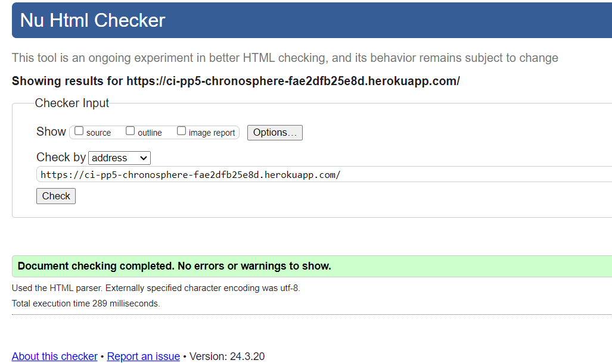

# Index - Table of Contents

- [Manual testing](#manual-testing)
- [Aditional validating testing](#additional-validation-testing)
  - [W3C Testing](#w3c-testing)
  - [JSHint Testing](#jshint-testing)
  - [PEP8 Testing](#pep8-testing)
- [Tested Browser](#tested-browser)

## Manual testing

| Feature                                                         | Expectation                                                                                       | Action                                                        | Result |
|-----------------------------------------------------------------|---------------------------------------------------------------------------------------------------|---------------------------------------------------------------|--------|
| Navbar for non-logged-in users                                  | Show "Home", "Sign in", "Sign Up" leading to the corresponding pages                             | Navigate through Navbar                                       |    ✔    |
| Navbar for logged-in users                                      | Show "Home", "Admin" (for Superusers only), "Feed", "Liked", "Sign Out", "Profile"               | Navigate through Navbar                                       |    ✔  |
| Homepage display                                                | Correct display of Navbar, all posts, Most Followed Profiles, Top 5 Categories, Footer           | Visit Homepage                                                |    ✔    |
| Search under Navbar                                             | Filters all posts by user or title                                                               | Use the search function                                       |    ✔   |
| Post information                                                | "Last Update" and "Created at" are displayed and correctly updated upon editing                  | Edit a post                                                   |    ✔    |
| Post functionalities                                            | "Like", "Comments", and "Copy Link" are correctly displayed and functional                       | Interact with a post                                          |    ✔    |
| Follow/unfollow functionality                                   | Updated upon clicking on the profile page and the Most Followed Profiles                         | Click follow/unfollow                                         |    ✔    |
| Like button interaction                                         | Set to like upon clicking and set to unlike upon clicking again                                  | Click the like button                                         |    ✔    |
| Copy link to clipboard                                          | Confirmation window appears after clicking, which can then be confirmed and closed               | Use the copy link feature                                     |    ✔    |
| Top 5 Categories display                                        | Displayed on the homepage and filters posts by category upon clicking a category                 | Click on a category                                           |    ✔    |
| Search within Top 5 Categories                                  | Filters only within the selected category                                                       | Use the search function within a category                     |     ✔   |
| Add Post functionality                                          | Image upload, title and content entry are functional, and category can be selected               | Add a new post                                                |    ✔    |
| Add Post image upload restrictions                              | Images larger than 4096px or greater than 2MB are not accepted                                   | Try to upload a large image                                   |    ✔    |
| Add Post default category                                       | Automatically assigns the category "General" if no category is selected                          | Add a post without selecting a category                       |    ✔    |
| Add Post creation                                               | Post is created upon clicking "Create", success message appears, and post page is loaded         | Click "Create" on the add post page                           |    ✔    |
| Add Post cancellation                                           | Cancels the entry and returns to the homepage upon clicking "Cancel"                             | Click "Cancel" on the add post page                           |    ✔    |
| Post Page comments display                                      | Comments are displayed after entry                                                               | Enter a comment                                               |    ✔    |
| Post Page comment update                                        | Comments can be updated, and the new comment is displayed immediately after saving               | Update a comment                                              |    ✔    |
| Post Page comment reply                                         | Replies to a comment are displayed correctly beneath it                                          | Reply to a comment                                            |    ✔    |
| Post Page comment replies button                                | "Show x Replies" is displayed for comments with replies, revealing them upon clicking            | Click the "Show x Replies" button                             |    ✔    |
| Post Page comment interaction                                   | Entering the reply field appears upon clicking "Reply", with options to cancel or submit a reply | Use the reply feature on a comment                            |    ✔    |
| Post Page comment functionalities                               | Edit and Delete functions are functional                                                         | Edit or delete a comment                                      |    ✔    |
| Sign up functionality                                           | Enter username and password, then redirected to login with redirection info displayed            | Complete the sign-up process                                  |    ✔    |
| Sign up password mismatch                                       | Display error message if passwords do not match                                                  | Enter mismatching passwords during sign up                    |    ✔    |
| Sign in functionality                                           | Enter username and password, then redirected to the homepage                                     | Complete the sign-in process                                  |    ✔    |
| Sign in error handling                                          | Display error message if username or password is incorrect                                        | Enter incorrect username or password                          |   ✔     |
| Most Followed Profiles display                                  | Display on all pages                                                                             | Navigate through pages                                        |    ✔    |
| Interaction with Most Followed Profiles                         | Clicking on a user leads to their profile page                                                   | Click on a user in Most Followed Profiles                     |    ✔    |
| Profile interaction from Most Followed Profiles                 | Clicking on one's own username goes to their profile page                                        | Click on one's own username in Most Followed Profiles         |    ✔    |
| Updates on Most Followed Profiles                               | Updates on the user's own profile page and on the Most Followed Profiles component               | View updates after an interaction                             |    ✔    |
| Feed content                                                    | Displays all posts from followed users                                                           | View the feed                                                 |    ✔    |
| Liked page content                                              | Displays all liked posts                                                                         | View the liked page                                           |    ✔    |
| Logged-in user profile page                                     | Displays all relevant information                                                                | View one's profile page                                       |    ✔    |
| Top 5 Categories on user's profile                              | Displays the user's own Top 5 Categories and filters posts by category upon clicking             | Click on a category on one's profile                          |    ✔    |
| Edit Profile functionality                                      | Current profile picture and bio are displayed and can be updated, success message upon saving    | Edit the profile                                              |    ✔    |
| Change Username functionality                                   | Username can be changed unless it is already taken, cancel to return to the profile page         | Attempt to change username                                    |    ✔    |
| Change Password functionality                                   | Password change is functional, with a notice if passwords do not match, cancel returns to profile | Attempt to change password                                    |   ✔     |
| Footer links interaction                                        | Links open correctly in a new browser page                                                       | Click on footer links                                         |    ✔    |

## Additional Validation Testing

In addition to the accessibility tests, several other tests were conducted to ensure the code quality and standard compliance of the project.

### W3C Testing

### ESLint Testing

### PEP8 Testing

Python code was analyzed using PEP8 and passed without any remarks.

  

## Tested Browser
   - Latest versions:
     <table>
       <thead>
       <tr>
       <th align="center">Browser</th>
       <th align="center">Layout</th>
       <th align="center">Functionality</th>
       </tr>
       </thead>
       <tbody>
         <tr>
         <td align="center">Chrome</td>
         <td align="center">✔</td>
         <td align="center">✔</td>
         </tr>
         <tr>
         <td align="center">Edge</td>
         <td align="center">✔</td>
         <td align="center">✔</td>
         </tr>
         <tr>
         <td align="center">Firefox</td>
         <td align="center">✔</td>
         <td align="center">✔</td>
         </tr>
         <tr>
         <td align="center">Safari</td>
         <td align="center">✔</td>
         <td align="center">✔</td>
         </tr>
       </tbody>
     </table>